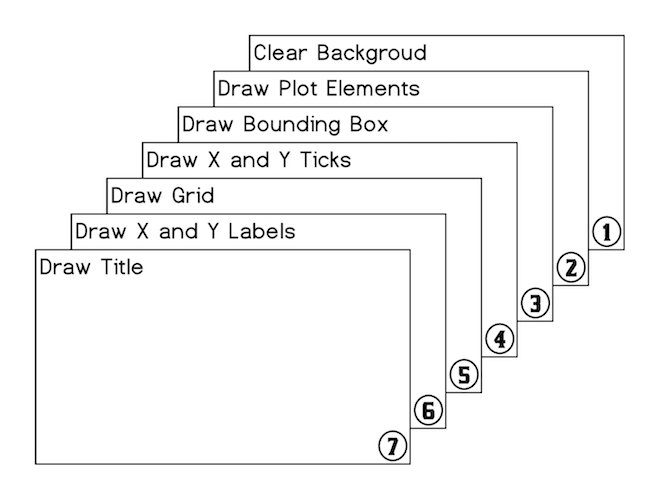
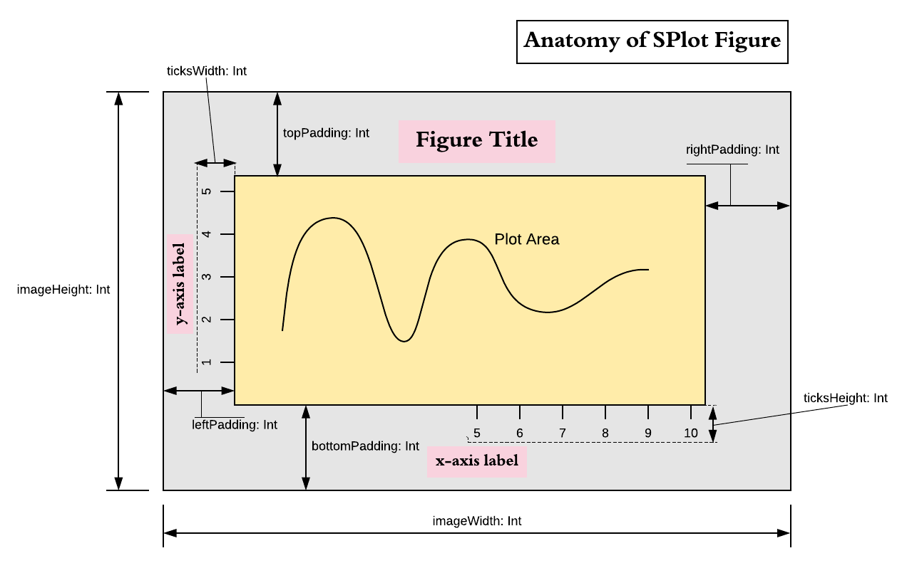

# Architecture

## Overview
Central element of the SPlot library is object `Figure`. Plot elements are added to
it and then it is either shown as interactive window or image generated directly
that can later be saved on disk. By itself however `Figure` does not do much. It
is really a skeleton which stitches together different objects required to form the
actual image or window. All of these objects are responsible for drawing themselves,
to which end they receive appropriate context and other parameters relevant to that
particular object. Some of the elements can appear multiple times in `Figure` such
as plots and labels that are added by using `Figure::add(...)` method and other
elements referenced by `Figure` exist in singular form. These later objects refer to
things like function that draws bounding box (a.k.a. spines of the figure) or
function that draws ticks etc. They are all supplied to the `Figure` constructor with
certain default values that can be changed to draw plots very differently. For
example you could change the way bounding box is plotted to draw it with rounded
corners or not draw bounding box at all. As a matter of fact default
objects/functions passed to `Figure` constructor already allow certain customization,
but creating your own custom versions gives complete freedom to modify figure drawing
behaviour.

## Pipeline Outline
To form an image after all plot elements already added to `Figure` upon calling
`crateImage(width, height)` or `show(width, height)` object `BufferedImage` is
created and following pipeline of actions is executed that modifies that image:



Each of the these steps from 1 to 9 are performed by externally supplied functions.
Plot elements drawn in stage 2 are the only ones that users usually explicitly add to
the figure. All other steps are performed by singularly referenced functions for
which default instances already supplied into `Figure` during construction.

## User-facing Figure Constructor Parameters

Besides objects and functions responsible for fulfilling steps of the drawing
pipeline users can pass following parameters to the `Figure` constructor:

```scala
name:          String = "Figure"
title:         String = ""
titleFont:     Font = Font.decode("Times-20")
xLabel:        String = ""
yLabel:        String = ""
bgColor:       Color = Color.WHITE
leftPadding:   Int = 50
rightPadding:  Int = 50
topPadding:    Int = 50
bottomPadding: Int = 50
antialiasing:  Boolean = true
showGrid:      Boolean = false
domain:        Option[(Double, Double)] = None
range:         Option[(Double, Double)] = None
xTicks:        (Double, Double) => Seq[(Double, String)] = Ticks.ticks10
yTicks:        (Double, Double) => Seq[(Double, String)] = Ticks.ticks5
```

Based on these parameters prior to executing drawing pipeline `DrawingContext` object
is created that contains all objects and functions required for pipeline steps to
draw themselves. `DrawingContext` contains important figure dimensions distances
`imageWidth, imageHeight, leftPadding, rightPadding, topPadding, bottomPadding: Int `
and a set of functions and other objects. Following image provides visual illustration
for that context of `DrawingContext`:



## Implicit Pipeline Step Functions

Pipeline steps are provided by the following functions:

1. Clear Background.

```scala
def backgroudPlotter(ctx: DrawingContext: bgColor: Color): Unit
```

2. Draw plot elements. Plot elements have three forms. Trait `Plot` for drawing lines
and shapes, trait `Label` for drawing text labels and `CompositePlotElement` that contains
sequence of the other two element types.

```scala
trait PlotElement

trait Plot extends PlotElement {
    def draw(ctx: DrawingContext): Unit
}

trait Label extends PlotElement {
    def draw(g2: Graphics2D, atPosition: (Int, Int)): Unit
}

case class CompositePlotElement(plotElements: Seq[Either[Plot, Label]])
    extends PlotElement
```

Note that plot elements are drawn in the order they were added to the figure
and thus can obscure each other.

3. Draw bounding box

```scala
def borderPlotter(ctx: DrawingContext, color: Color): Unit
```

4. Draw ticks. First we draw ticks on the x-axis and then on the y-axis.
To that end we call following two functions

```scala
def xTicksPlotter(ctx: DrawingContext, ticks: Seq[(Double, String)]): Int
```

and

```scala
def yTicksPlotter(ctx: DrawingContext, ticks: Seq[(Double, String)]): Int
```

These functions are responsible for drawing the ticks and their labels. They
must return height/length of the ticks together with labels. These values are
later passed to `xLabelPlotter` and `yLabelPlotter` which use them to find
proper placement for `x` and `y` labels.

5. Draw grid

```scala
def gridPlotter(ctx: DrawingContext, xTicks: Seq[Int], yTicks: Seq[Int]): Unit
```

6. Draw `x` and `y` labels using following two functions.

```scala
def xLabelPlotter(ctx: DrawingContex, ticksLength: Int, text: String): Unit

def yLabelPlotter(ctx: DrawingContex, ticksLength: Int, text: String): Unit
```

7. Draw figure title

```scala
def titlePlotter(DrawingContext, String, Font): Unit
```
