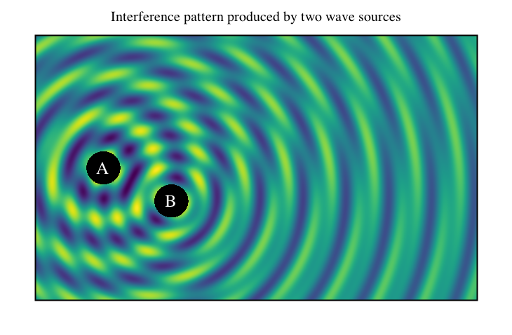

# Heatmap-like plot

Lets plot 2-d interference pattern of two wave sources using heatmap-like
plot.

```scala
import java.awt.Color.WHITE
import java.awt.Font
import java.lang.Math.{pow, sin}

import xyz.devfortress.splot.Anchor.CENTER
import xyz.devfortress.splot._

def main(args: Array[String]): Unit = {
  val fig = Figure(name = "Wave Interference",
    title = "Interference pattern produced by two wave sources",
    yTicks = Ticks(), xTicks = Ticks(),
  )

  def waveFunction(x: Double, y: Double, freq: Double, phase: Double): Double = {
    val r = pow(pow(x,2) + pow(y, 2), 0.5)
    if (r < 0.5) 0 else sin(freq * (r + phase))/pow(r, 0.3)
  }

  // This black rectangle will be drawn below heatmap plot and will be seen
  // through two holes as defined by inDomain function below.
  fig.rectangle((-2, -2), 5, 5, fillColor = "black")

  // Heatmap-like plot of two waves interfering with each other produced by two sources
  // at coordinates (0, 0) and (2,-1) working at two different frequencies and out of sync.
  // Domain is defines by combination of xDomain, yDomain values that define overall
  // rectangle and inDomain function that limits domain farther and can define arbitrary
  // domain. By default it uses colormap "viridis". You can switch it to use other colormaps
  // either user defined or or of the predefined one "viridis" or "inferno".
  fig.map(
    (x, y) => 2 * waveFunction(x, y, 5, 0) + waveFunction (x - 2, y + 1, 10, 1),
    xDomain = (-2, 11), yDomain = (-4, 4),
    // Function inDomain limits domain to the outside of two circles of radius 0.5
    // centered at the wave sources.
    inDomain = (x, y) => {
      val r1 = pow(pow(x,2) + pow(y, 2), 0.5)
      val r2 = pow(pow(x - 2,2) + pow(y + 1, 2), 0.5)
      r1 > 0.5 && r2 > 0.5
    }
  )

  val labelFont = Font.decode("Times-25")
  fig add Label("A", 0, 0, color = WHITE, font = labelFont, anchor = CENTER)
  fig add Label("B", 2, -1, color = WHITE, font = labelFont, anchor = CENTER)

  fig.show(730, 500)
}
```


