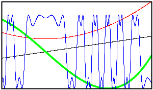

# SPlot

@@@ index

* [Examples](Examples/index.md)
* [Scala Objects](Scala_Objects/index.md)

@@@

SPlot is a plotting library for Scala that aspires to provide the same level of functionality matplotlib does for
Python users. At the moment it is far away from this goal but is already usable.

 

Current version of this library is available on maven central at these coordinates

sbt
: @@snip [build.sbt](snp/build.sbt) { }

maven
: @@snip [pom.xml](snp/pom.xml) { }

Source for the library is available through anonymous http.

```bash
$ git clone http://git.devfortress.xyz/splot
```